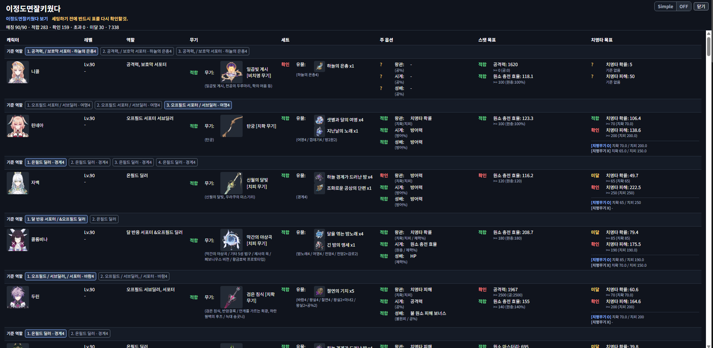

# 한눈에 이잘키 정오표 / jalkiwotda-hoyoverse

HoYoLAB 원신, 붕괴: 스타레일, 젠레스 존 제로 전적 페이지에서 캐릭터 정보를 읽어, 커뮤니티 기준표 **"이정도면 잘키웠다"** 와 비교하는 브라우저 확장 프로그램이다.

> 이 프로젝트는 HoYoverse 공식 프로젝트가 아닌 팬 메이드 도구이다.

저장소: https://github.com/acapzed/jalkiwotda-hoyoverse

---

## 주요 기능

- 원신, 붕괴: 스타레일, 젠레스 존 제로 전적 페이지를 하나의 확장 프로그램에서 지원
- HoYoLAB 전적 페이지에서 캐릭터 데이터 캡처
- 여러 캐릭터를 한 번에 분석
- 각 게임의 "이정도면 잘키웠다" 구글 스프레드시트 기준과 비교
- 무기/광추/엔진, 장비 세트, 주 옵션, 주요 스탯 목표 표시
- 브라우저 안에서 HTML 리포트 생성
- 별도 서버 없이 로컬 브라우저에서 동작

---

## 설치

**Chrome Web Store**

Chrome 사용자는 아래 링크에서 바로 설치할 수 있다.

https://chromewebstore.google.com/detail/ilgdadofigikokamdfgamikpdgbhkgeo?utm_source=item-share-cb

**개발자 모드 수동 설치**

Chrome Web Store를 사용할 수 없거나 로컬 버전을 테스트할 때는 개발자 모드로 직접 불러와서 사용할 수 있다.

**Chrome / Edge 공통**

1. 이 저장소를 내려받거나 압축을 푼다.
2. 브라우저 확장 프로그램 관리 페이지를 연다.
   - Chrome: `chrome://extensions`
   - Edge: `edge://extensions`
3. 오른쪽 위의 **개발자 모드**를 켠다.
4. **압축해제된 확장 프로그램을 로드**를 클릭한다.
5. `manifest.json`이 있는 저장소 루트 폴더를 선택한다.
6. 목록에 `jalkiwotda-hoyoverse`가 표시되면 설치가 완료된다.

---

## 사용할 사이트

아래 링크를 브라우저 즐겨찾기에 추가한 뒤, 즐겨찾기에서 바로 열어 사용하는 것을 권장한다. HoYoLAB 페이지 구조가 복잡해 일반 메뉴에서 다른 페이지로 들어가면 확장 프로그램 패널이 보이지 않을 수 있다.

| 게임 | 즐겨찾기할 링크 |
|------|----------------|
| 원신 | https://act.hoyolab.com/app/community-game-records-sea/index.html#/ys |
| 붕괴: 스타레일 | https://act.hoyolab.com/app/community-game-records-sea/index.html#/hsr |
| 젠레스 존 제로 | https://act.hoyolab.com/app/zzz-game-record/index.html |

기준표 원본을 확인해야 할 때는 아래 구글 스프레드시트를 참고한다.

| 게임 | 기준표 링크 |
|------|------------|
| 원신 | https://docs.google.com/spreadsheets/d/1sjVkeR8s41wW0oTtBHC1at9riOxWqyXPcbJscYI8fdE |
| 붕괴: 스타레일 | https://docs.google.com/spreadsheets/d/1kRQjQrHsgIDqPdnyDCVXG59Ge8AaKm0dyJvj6Vp2AY4 |
| 젠레스 존 제로 | https://docs.google.com/spreadsheets/d/1C3ZpKCTQJXFwUBgZKZRdLOvGqDGlVijb |

---

## 사용법

1. 확장 프로그램을 설치한 브라우저에서 HoYoLAB에 로그인한다.
2. HoYoLAB 언어를 **한국어**로 설정한다.
3. 위 표의 게임별 HoYoLAB 링크를 즐겨찾기하고, 즐겨찾기에서 원하는 게임 전적 페이지를 연다.
4. 페이지를 새로고침한다.
5. 화면 오른쪽 아래에 패널이 나타난다.
6. HoYoLAB이 캐릭터 정보를 로드하면 **불러온 정보** 숫자가 올라간다.
7. **정오표 보기** 버튼을 누르면 분석 리포트가 표시된다.

> **참고** - HoYoLAB 언어가 한국어가 아니면 캐릭터 이름·스탯명이 매칭되지 않는다. 이 경우 확장 프로그램이 언어 변경 안내를 표시한다.

### 패널 버튼

| 버튼 | 설명 |
|------|------|
| 정오표 보기 | 현재 캡처된 캐릭터 정보를 기준표와 비교해 리포트를 연다 |
| 새로고침 | 캡처 데이터를 초기화하고 HoYoLAB 페이지를 새로고침한다 |

---

## 리포트 항목

| 항목 | 원신 | 붕괴: 스타레일 | 젠레스 존 제로 |
|------|------|----------------|----------------|
| 캐릭터 | 캐릭터 이름 | 캐릭터 이름 | 캐릭터 이름 |
| 레벨 | 레벨 및 운명의 자리 | 레벨 및 성혼 | 레벨 및 시네마 |
| 역할 | 기준표 역할 | 기준표 역할 | 기준표 역할 |
| 장비 | 무기 | 광추 | 엔진 |
| 세트 | 성유물 세트 | 유물/장신구 세트 | 디스크 4세트/2세트 |
| 주 옵션 | 몸통·신발·성배·왕관 | 몸통·신발·구체·매듭 | 4번·5번·6번 디스크 |
| 스탯 목표 | 주요 스탯 목표와 현재 스탯 비교 | 주요 스탯 목표와 현재 스탯 비교 | 주요 스탯 목표와 현재 스탯 비교 |

**표시 상태**

- `적합` - 기준에 맞거나 허용 범위로 판단됨
- `확인` - 기준과 맞지 않는 것으로 판단됨
- `?` - 데이터가 없거나 자동 판단이 어려움

---

## 데이터 및 권한

이 확장 프로그램이 사용하는 데이터는 다음과 같다.

- HoYoLAB 페이지가 브라우저에서 로드한 캐릭터 응답
- 공개 구글 스프레드시트 기준표
- 일부 게임의 HoYoWiki 장비 세트 이름 정보

로그인 토큰이나 비밀번호를 수집하지 않으며, 모든 분석은 사용자의 브라우저 안에서 처리된다. 외부 서버로 데이터를 전송하지 않는다.

브라우저 권한에는 기준표를 가져오기 위한 `docs.google.com` 접근이 포함된다.

개인정보 처리방침은 [PRIVACY.md](PRIVACY.md)를 참고한다. Chrome Web Store 제출용 메모와 권한 설명은 [CHROME_WEB_STORE.md](CHROME_WEB_STORE.md)에 정리했다.

---

## 문제 해결

**패널이 보이지 않을 때**
- 위의 게임별 HoYoLAB 링크를 즐겨찾기하고, 해당 즐겨찾기 링크로 다시 접속한다.
- 확장 프로그램 설치 후 페이지를 새로고침한다.
- `chrome://extensions`에서 확장 프로그램이 활성화되어 있는지 확인한다.

**"불러온 정보"가 계속 0일 때**
- HoYoLAB에 로그인되어 있는지 확인한다.
- 캐릭터 정보가 완전히 로드될 때까지 기다린 후 다시 확인한다.
- 페이지를 새로고침하고 재시도한다.

**리포트가 뜨지 않고 "아직 캐릭터 정보를 가져오지 못했습니다"가 표시될 때**
- HoYoLAB 페이지를 새로고침한 뒤 캐릭터 정보가 완전히 로드될 때까지 기다렸다가 **정오표 보기**를 다시 누른다.

**기준표와 매칭이 안 될 때**
- HoYoLAB 언어가 한국어인지 확인한다.
- 여행자, 개척자처럼 속성이나 운명의 길에 따라 이름이 달라지는 캐릭터는 자동 매칭이 제한될 수 있다.
- HoYoLAB 데이터 구조나 기준표 표기가 변경된 경우 일부 항목이 `매칭 없음` 또는 `?`로 표시될 수 있다.

---

## 현재 한계

- HoYoLAB 페이지 구조나 API 응답 형식이 변경되면 동작하지 않을 수 있다.
- 기준표의 셀 구조가 크게 바뀌면 파싱이 실패할 수 있다.
- 자동 비교는 기준표 문구와 HoYoLAB 표기를 정규화하여 매칭하는 방식으로, 모든 케이스를 완벽하게 판단하지는 못한다.
- 현재 리포트 UI는 검증 목적의 간단한 HTML 테이블 형태이다.

## 구조

- `src/genshin`: 원신 버전 코드
- `src/hsr`: 붕괴: 스타레일 버전 코드
- `src/zzz`: 젠레스 존 제로 버전 코드
- `src/background`: HoYoverse 통합 공용 service worker

각 게임 코드는 기존 단독 확장의 namespace와 message type을 유지한다.
